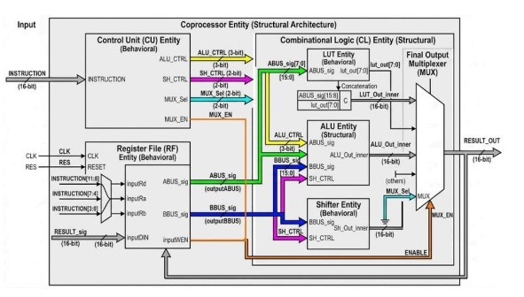
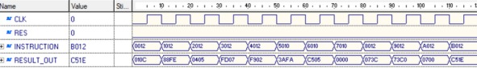

<div align="center">


<br/>


<h1>16-bit Cryptographic Coprocessor</h1>

<p><em>A modular VHDL hardware accelerator for cryptographic operations</em><br/>
<em>Faculty of Engineering · Zagazig University</em><br/>
<strong>Supervised by: Dr. Howida Abd AlLatif</strong></p>

<br/>


</div>

---

##  Table of Contents

- [Overview](#-overview)
- [Repository Structure](#-repository-structure)
- [System Architecture](#-system-architecture)
- [Instruction Set Architecture](#-instruction-set-architecture)
- [Port Specification](#-port-specification)
- [Module Details](#-module-details)
- [Simulation Results](#-simulation-results)
- [Getting Started](#-getting-started)
- [References](#-references)
- [Team](#-team)

---

##  Overview

This project implements a fully functional **16-bit Cryptographic Coprocessor** in VHDL, designed to offload computationally intensive cryptographic tasks from a main processor. The coprocessor provides dedicated hardware support for:

| Category | Operations |
|----------|-----------|
|  Arithmetic | `ADD`, `SUB` |
|  Logical | `AND`, `OR`, `XOR`, `NOT`, `MOV`, `NOP` |
|  Shift / Rotate | `ROR8`, `ROR4`, `SLL8` |
|  Substitution | `LUT` (S-Box non-linear substitution) |

The design follows a **structured, modular architecture** where each functional unit is independently designed, simulated, and then integrated into a top-level entity. The system supports a **12-instruction ISA** encoded in a 16-bit instruction word and was verified using **Active-HDL** with assertion-based testbenches.

---

##  Repository Structure

```
Cryptographic-Coprocessor/
│
├──  assets/
│   ├── logo.png                     ← University logo
│   └── name.png                     ← Project name asset
│
├──  docs/
│   ├──  Screenshots/
│   │   ├── schematic.png            ← Block diagram / schematic
│   │   └── waveform.png             ← Simulation waveforms
│   ├── Presentation.pptx            ← Project slides
│   └── report.pdf                   ← Full technical report
│
├──  src/
│   ├──  code/                     ← RTL source files
│   │   ├── ALU.vhd                  ← Arithmetic & Logic Unit
│   │   ├── Comb_Logic.vhd           ← Combinational logic + MUX
│   │   ├── Control_Unit.vhd         ← Instruction decoder
│   │   ├── Coprocessor.vhd          ← Top-level entity
│   │   ├── LUT.vhd                  ← S-Box substitution table
│   │   ├── register_file.vhd        ← 16×16-bit register file
│   │   └── Shifter.vhd              ← Barrel shifter unit
│   │
│   └──  testbench/                ← Verification testbenches
│       ├── ALU_tb.vhd
│       ├── Comb_Logic_TB.vhd
│       ├── Control_Unit_TB.vhd
│       ├── Coprocessor_TB.vhd       ← Integration testbench
│       ├── LUT_tb.vhd
│       ├── Shifter_TB.vhd
│       └── tb_register_file.vhd
│
├──  .gitignore
├──  LICENSE
└──  README.md
```

---

##  System Architecture





### Instruction Word Encoding

```
 15       12  11        8  7         4  3         0
 ┌──────────┬──────────┬──────────┬──────────┐
 │   CTRL   │    Rd    │    Ra    │    Rb    │
 │ (opcode) │  (dest)  │ (src A)  │ (src B)  │
 └──────────┴──────────┴──────────┴──────────┘
```

### Key Design Constraints

-  All operations share a **single 16-bit result bus (RES)**
-  Instruction word is exactly **16 bits**, split into **four 4-bit fields**
-  All functional units **operate in parallel** — MUX selects the correct output
-  Register file supports **simultaneous dual-port reads** and **single-port write**

---

## Instruction Set Architecture

### ALU Operations — `CTRL[3] = '0'`

| Opcode | Mnemonic | ALUctrl | Operation |
|--------|----------|---------|-----------|
| `0000` | `ADD` | `001` | `ALUOUT ← ABUS + BBUS` (signed) |
| `0001` | `SUB` | `010` | `ALUOUT ← ABUS − BBUS` (signed) |
| `0010` | `AND` | `011` | `ALUOUT ← ABUS & BBUS` |
| `0011` | `OR`  | `100` | `ALUOUT ← ABUS \| BBUS` |
| `0100` | `XOR` | `101` | `ALUOUT ← ABUS ^ BBUS` |
| `0101` | `NOT` | `110` | `ALUOUT ← ~ABUS` |
| `0110` | `MOV` | `111` | `ALUOUT ← ABUS` |
| `0111` | `NOP` | `000` | No Operation |

### Shifter Operations — `CTRL[3:2] = "10"`

| Opcode | Mnemonic | ShiftCtrl | Operation | Example |
|--------|----------|-----------|-----------|---------|
| `1000` | `ROR8` | `01` | Rotate right by 8 bits | `0x1234 → 0x3412` |
| `1001` | `ROR4` | `10` | Rotate right by 4 bits | `0x1234 → 0x4123` |
| `1010` | `SLL8` | `11` | Shift left logical by 8 | `0x1234 → 0x3400` |

### Substitution — `CTRL = "1011"`

| Opcode | Mnemonic | MuxCtrl | Operation |
|--------|----------|---------|-----------|
| `1011` | `LUT` | `10` | `S-Box1(ABUS[7:4]) & S-Box2(ABUS[3:0])` |

### Control Signal Truth Table

| Operation | Opcode | WEN | ALUctrl | ShifterCtrl | MuxCtrl |
|-----------|--------|-----|---------|-------------|---------|
| ADD  | `0000` | 1 | 001 | 00 | 01 |
| SUB  | `0001` | 1 | 010 | 00 | 01 |
| AND  | `0010` | 1 | 011 | 00 | 01 |
| OR   | `0011` | 1 | 100 | 00 | 01 |
| XOR  | `0100` | 1 | 101 | 00 | 01 |
| NOT  | `0101` | 1 | 110 | 00 | 01 |
| MOV  | `0110` | 1 | 111 | 00 | 01 |
| NOP  | `0111` | 1 | 000 | 00 | 01 |
| ROR8 | `1000` | 1 | 000 | 01 | 10 |
| ROR4 | `1001` | 1 | 000 | 10 | 10 |
| SLL8 | `1010` | 1 | 000 | 11 | 10 |
| LUT  | `1011` | 1 | 000 | 00 | 11 |

---

##  Port Specification

| Signal | Direction | Width | Description |
|--------|-----------|-------|-------------|
| `CLK` | Input | 1-bit | System clock — rising-edge triggered |
| `RES` | Input | 1-bit | Active-high synchronous reset |
| `INSTRUCTION` | Input | 16-bit | Full 16-bit instruction word |
| `RESULT_OUT` | Output | 16-bit | Final computed result |

> Internally decoded: `INSTRUCTION[15:12]`→CTRL · `[11:8]`→Rd · `[7:4]`→Ra · `[3:0]`→Rb

---

##  Module Details

### 1.  Register File — `register_file.vhd`

- **16 × 16-bit** general-purpose registers (R0–R15), pre-initialized with test values
- Synchronous write on **rising clock edge** when `inputWEN = '1'`
- **Dual-port read** (`inputRa`, `inputRb`) → (`outputABUS`, `outputBBUS`)
- Active-high `inputRES` clears all registers to zero

```vhdl
entity register_file is
  port (
    inputCLK   : in  std_logic;
    inputRES   : in  std_logic;
    inputWEN   : in  std_logic;
    inputRa    : in  std_logic_vector(3 downto 0);
    inputRb    : in  std_logic_vector(3 downto 0);
    inputRd    : in  std_logic_vector(3 downto 0);
    inputDIN   : in  std_logic_vector(15 downto 0);
    outputABUS : out std_logic_vector(15 downto 0);
    outputBBUS : out std_logic_vector(15 downto 0)
  );
end entity register_file;
```

---

### 2.  ALU — `ALU.vhd`

- Purely **combinational** 16-bit unit (Structural architecture)
- Controlled by 3-bit `input_CTRL` using a `with/select` statement
- Uses `ieee.std_logic_signed` for signed arithmetic

```vhdl
entity ALU is
  port (
    input_A    : in  std_logic_vector(15 downto 0);
    input_B    : in  std_logic_vector(15 downto 0);
    input_CTRL : in  std_logic_vector(2 downto 0);
    OUTPUT     : out std_logic_vector(15 downto 0)
  );
end ALU;
```

---

### 3.  Shifter — `Shifter.vhd`

- Combinational **16-bit barrel shifter** (Behavioral architecture)
- Operates on `BBUS`; controlled by 2-bit `input_CTRL`
- Uses `rotate_right` / `shift_left` from `ieee.numeric_std`

```vhdl
entity Shifter is
  port (
    input      : in  std_logic_vector(15 downto 0);
    input_CTRL : in  std_logic_vector(1 downto 0);
    output     : out std_logic_vector(15 downto 0)
  );
end entity;
```

---

### 4.  LUT S-Box — `LUT.vhd`

- Non-linear substitution layer for **cryptographic confusion** (Behavioral architecture)
- 8-bit input → split into two 4-bit nibbles → each through an independent 16-entry S-Box
- Outputs concatenated: `output <= S_Box1 & S_Box2`

```
LUTIN[7:4] ──► S-Box 1 ──► S_Box1 ──┐
                                      ├──► output[7:0]
LUTIN[3:0] ──► S-Box 2 ──► S_Box2 ──┘
```

```vhdl
entity LUT is
  port (
    input  : in  std_logic_vector(7 downto 0);
    output : out std_logic_vector(7 downto 0)
  );
end entity;
```

---

### 5.  Control Unit — `Control_Unit.vhd`

- Purely **combinational decoder** (Behavioral architecture)
- Decodes `instruction[15:12]` and generates all control signals
- Routes execution to ALU, Shifter, or LUT path

```vhdl
entity Control_Unit is
  port (
    instruction : in  std_logic_vector(15 downto 0);
    MUX_EN      : out std_logic;
    ALU_CTRL    : out std_logic_vector(2 downto 0);
    SH_CTRL     : out std_logic_vector(1 downto 0);
    MUX_Sel     : out std_logic_vector(1 downto 0)
  );
end entity;
```

---

### 6.  Combinational Logic — `Comb_Logic.vhd`

- Structural + Behavioral architecture
- Instantiates ALU, Shifter, and LUT — all execute **in parallel**
- `MUX_EN` and `MUX_Sel` route the correct result to `RESULT`

```vhdl
entity Comb_Logic is
  port (
    ABUS, BBUS : in  std_logic_vector(15 downto 0);
    ALU_CTRL   : in  std_logic_vector(2 downto 0);
    SH_CTRL    : in  std_logic_vector(1 downto 0);
    MUX_Sel    : in  std_logic_vector(1 downto 0);
    MUX_EN     : in  std_logic;
    RESULT     : out std_logic_vector(15 downto 0)
  );
end entity;
```

---

### 7.  Coprocessor (Top-Level) — `Coprocessor.vhd`

- **Structural architecture** connecting all sub-entities
- Parses instruction fields and wires all internal signals
- Single unified interface: `INSTRUCTION` in → `RESULT_OUT` out

---


### Simulation Waveforms



| Signal | Description |
|--------|-------------|
| `CLK` | System clock |
| `RES` | Active-high reset |
| `INSTRUCTION` | 16-bit instruction word |
| `RESULT_OUT` | Computed output after execution |

---

### Verification Summary

| # | Test | Result |
|---|------|--------|
| 1 | ADD (0000) — signed addition, WEN write-back |  Pass |
| 2 | SUB (0001) — signed subtraction |  Pass |
| 3 | AND / OR / XOR / NOT / MOV — bitwise operations |  Pass |
| 4 | ROR8 (1000) — `0x1234 → 0x3412` | Pass |
| 5 | ROR4 (1001) — `0x1234 → 0x4123` |  Pass |
| 6 | SLL8 (1010) — `0x1234 → 0x3400` |  Pass |
| 7 | LUT S-Box (1011) — nibble substitution |  Pass |
| 8 | Control routing — CTRL[3] MUX path selection |  Pass |
| 9 | Integration — all 12 ISA instructions sequential |  Pass |

---

## Getting Started

### Prerequisites

- **Active-HDL** (Aldec) — simulator used in this project
- Or any VHDL-compatible tool: ModelSim, GHDL, Vivado Simulator

### Simulation Steps

```bash
# 1. Clone the repository
git clone https://github.com/your-username/Cryptographic-Coprocessor.git
cd Cryptographic-Coprocessor

# 2. Open Active-HDL and create a new workspace

# 3. Add source files from src/code/ in this order:
#    ALU.vhd → LUT.vhd → Shifter.vhd → register_file.vhd
#    → Control_Unit.vhd → Comb_Logic.vhd → Coprocessor.vhd

# 4. Add testbench from src/testbench/
#    Set top-level: Coprocessor_TB.vhd

# 5. Compile all → Run simulation → View waveforms
```

### Compilation Order (Bottom-Up)

```
1. ALU.vhd              ← no dependencies
2. LUT.vhd              ← no dependencies
3. Shifter.vhd          ← no dependencies
4. register_file.vhd    ← no dependencies
5. Control_Unit.vhd     ← no dependencies
6. Comb_Logic.vhd       ← instantiates: ALU, LUT, Shifter
7. Coprocessor.vhd      ← instantiates: Control_Unit, register_file, Comb_Logic
8. Coprocessor_TB.vhd   ← top-level testbench
```

---

##  References

1. *Active-HDL User Guide* — Aldec Inc.
2. Pong P. Chu — *FPGA Prototyping by VHDL Examples*, Wiley
3. Douglas L. Perry — *VHDL Programming by Example*, McGraw-Hill

---

##  Team

<table>
  <thead>
    <tr>
      <th>ID</th>
      <th>Name</th>
      <th>Role</th>
      <th>Contact</th>
    </tr>
  </thead>
  <tbody>
    <tr>
      <td><code>2990</code></td>
      <td><strong>Ahmed Waleed Fattouh </strong></td>
      <td>LUT · Report · System Integration · <strong>Team Leader</strong></td>
      <td><a href="mailto:ahmedelgebali574@gmail.com">ahmedelgebali574@gmail.com</a></td>
    </tr>
    <tr>
      <td><code>2988</code></td>
      <td>Ahmed Moataz Ali Bakheet</td>
      <td>Control Unit · Integration</td>
      <td><a href="mailto:ahmedmoataz725@gmail.com">ahmedmoataz725@gmail.com</a></td>
    </tr>
    <tr>
      <td><code>2991</code></td>
      <td>Islam Osama El-Sayed Mohamed</td>
      <td>Register File</td>
      <td><a href="mailto:eslamage20@gmail.com">eslamage20@gmail.com</a></td>
    </tr>
    <tr>
      <td><code>2987</code></td>
      <td>Ahmed Mahmoud El-Khouly</td>
      <td>Shifter · Presentation</td>
      <td><a href="mailto:elkholy52005@gmail.com">elkholy52005@gmail.com</a></td>
    </tr>
    <tr>
      <td><code>2989</code></td>
      <td>Ahmed Haitham Salah Mohamed</td>
      <td>ALU · Integration</td>
      <td><a href="mailto:ahmedhaitham2340@gmail.com">ahmedhaitham2340@gmail.com</a></td>
    </tr>
  </tbody>
</table>

---

<div align="center">

**Faculty of Engineering · Zagazig University**

*Supervised by Dr. Howida Abd AlLatif*


</div>

